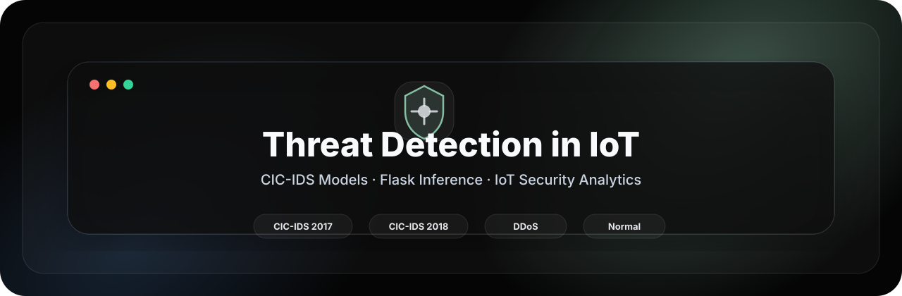
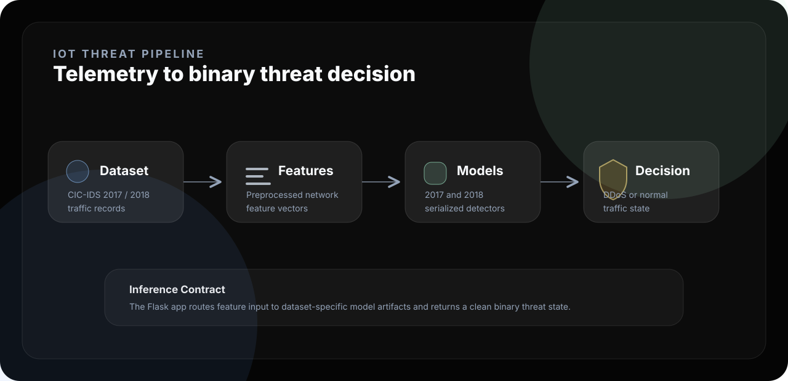
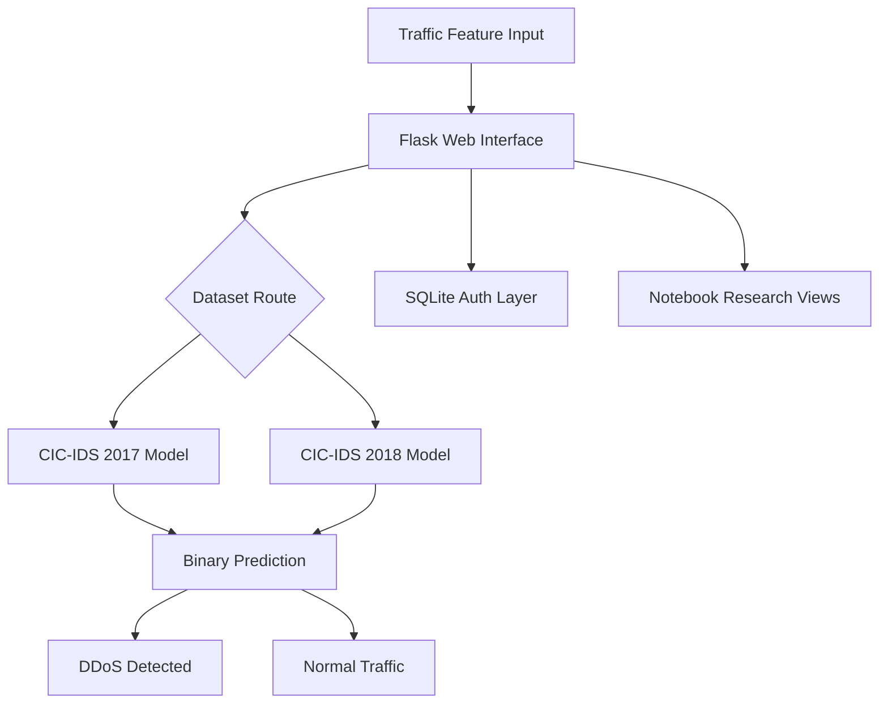
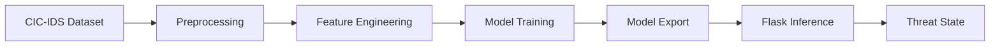

<div align="center">



<br />

<p>
  <strong>Analyze IoT telemetry.</strong> <strong>Run dataset-specific models.</strong> <strong>Classify threat state.</strong>
</p>

<p>
  
  
  
  
</p>

</div>

---

<div align="center">

<table>
<tr>
<td align="center" width="25%"><strong>Domain</strong><br />IoT Security</td>
<td align="center" width="25%"><strong>Models</strong><br />CIC-IDS 2017 / 2018</td>
<td align="center" width="25%"><strong>Output</strong><br />DDoS / Normal</td>
<td align="center" width="25%"><strong>Interface</strong><br />Flask Web App</td>
</tr>
</table>

</div>

---

## 01 · Overview

<table>
<tr>
<td width="58%" valign="top">

### Intelligent threat detection for IoT-style traffic

This repository implements an IoT threat detection prototype with Flask-based inference and machine learning model artifacts for CIC-IDS 2017 and CIC-IDS 2018 workflows.

The system accepts traffic feature values, routes them through the selected trained model, and returns a clear binary security decision: **DDoS detected** or **normal traffic**.

</td>
<td width="42%" valign="top">

```text
┌──────────────────────────────┐
│  IOT THREAT CONSOLE          │
├──────────────────────────────┤
│  Input      Traffic Features │
│  Dataset    CIC-IDS 17 / 18  │
│  Model      Serialized ML    │
│  Output     DDoS / Normal    │
│  UI         Flask Interface  │
└──────────────────────────────┘
```

</td>
</tr>
</table>

---

## 02 · Threat Pipeline



---

## 03 · System Architecture



---

## 04 · Key Features

| Feature | Purpose |
|---|---|
| Dataset-specific inference | Supports separate model paths for CIC-IDS 2017 and CIC-IDS 2018. |
| Flask prediction interface | Provides a browser-based workflow for feature input and model output. |
| Binary threat decision | Classifies traffic state as DDoS or Normal. |
| Notebook access routes | Exposes CIC-IDS research artifacts through application pages. |
| Authentication flow | Includes SQLite-backed signup/signin workflow for demo access. |
| Research-oriented model flow | Connects dataset analysis, model artifacts, and web inference. |

---

## 05 · ML Workflow



| Stage | Output |
|---|---|
| Dataset preparation | CIC-IDS 2017 / 2018 traffic records. |
| Feature engineering | Model-ready numerical feature vectors. |
| Training | Binary classifier for DDoS-vs-normal prediction. |
| Evaluation | Accuracy, precision, recall, F1-score, confusion matrix. |
| Inference | Web-accessible prediction runtime. |

---

## 06 · Installation

```bash
git clone https://github.com/ns7523/Threat-Detection-in-IoT.git
cd Threat-Detection-in-IoT
python -m venv .venv
source .venv/bin/activate
pip install flask pandas numpy scikit-learn joblib matplotlib seaborn
```

---

## 07 · Usage

Run the Flask application:

```bash
python app.py
```

Open the local interface:

```text
http://127.0.0.1:5000
```

Prediction routes:

```text
/predict   CIC-IDS 2017 model inference
/predict1  CIC-IDS 2018 model inference
```

---

## 08 · Project Structure

```text
.
├── assets/
│   └── brand/
│       ├── hero.svg
│       └── pipeline.svg
├── app.py
├── model_2017.sav
├── model_2018.sav
├── signup.db
├── templates/
├── static/
└── README.md
```

Suggested production structure:

```text
docs/ · src/ · models/ · data/ · results/ · notebooks/ · assets/screenshots/ · requirements.txt
```

---

## 09 · Visual Assets

<table>
<tr>
<td width="50%" valign="top">

### Prediction Interface

`assets/screenshots/prediction-form.png`

Feature input UI for model inference.

</td>
<td width="50%" valign="top">

### Threat Result

`assets/screenshots/threat-result.png`

DDoS or normal output state.

</td>
</tr>
<tr>
<td width="50%" valign="top">

### Model Metrics

`assets/screenshots/model-metrics.png`

Accuracy, precision, recall, F1-score, and confusion matrix.

</td>
<td width="50%" valign="top">

### Research View

`assets/screenshots/research-notebook.png`

Rendered CIC-IDS notebook artifact.

</td>
</tr>
</table>

---

## 10 · Security Notes

- Move credentials and mail configuration into environment variables.
- Hash stored passwords before production-style deployment.
- Validate and bound-check all feature inputs before inference.
- Add pinned dependencies through `requirements.txt`.

---

## 11 · Future Improvements

- [ ] Add reproducible training notebooks for CIC-IDS 2017 and 2018.
- [ ] Add pinned `requirements.txt`.
- [ ] Move application and ML logic into `src/`.
- [ ] Add model metrics under `results/`.
- [ ] Add Docker support for isolated runtime.
- [ ] Add polished screenshots under `assets/screenshots/`.
- [ ] Add a formal open-source license.

---

<div align="center">

### N S Akash

**AI & Cybersecurity Engineer**

<p>
  <a href="https://github.com/ns7523"></a>
  <a href="https://nsakash.in"></a>
  <a href="mailto:contact@nsakash.in"></a>
  <a href="https://www.linkedin.com/in/nsakash7523"></a>
</p>

</div>
